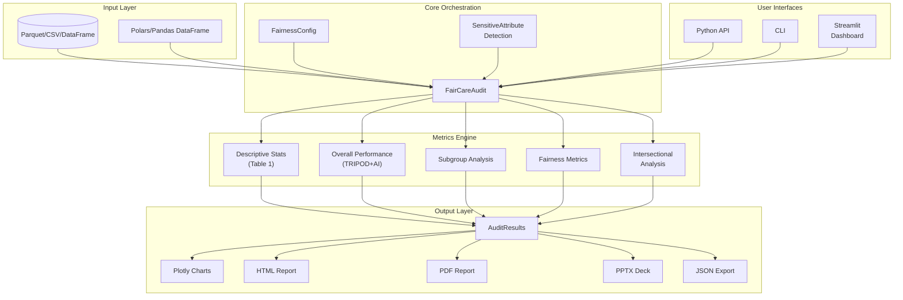
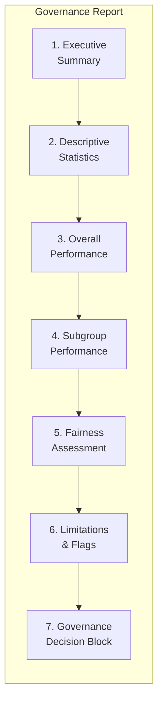

# FairCareAI Architecture

## Overview

FairCareAI is a Python package for auditing machine learning models for fairness in clinical contexts. It follows the **Van Calster et al. (2025)** methodology and aligns with the **CHAI RAIC Checkpoint 1** framework.

**Core Philosophy:** Package SUGGESTS, humans DECIDE

All outputs are advisory. Final deployment decisions rest with clinical stakeholders and governance committees.

---

## System Architecture



---

## Data Flow Pipeline

```
┌─────────────────────────────────────────────────────────────────────────┐
│                           DATA FLOW                                      │
├─────────────────────────────────────────────────────────────────────────┤
│                                                                          │
│  1. INPUT                                                                │
│     ┌──────────────┐     ┌──────────────┐     ┌──────────────┐         │
│     │   Parquet    │     │     CSV      │     │  DataFrame   │         │
│     └──────┬───────┘     └──────┬───────┘     └──────┬───────┘         │
│            │                    │                    │                  │
│            └────────────────────┼────────────────────┘                  │
│                                 ▼                                        │
│                      ┌──────────────────┐                               │
│                      │  Polars DataFrame │  (internal format)           │
│                      └────────┬─────────┘                               │
│                               │                                          │
│  2. CONFIGURATION             │                                          │
│     ┌─────────────────────────┼─────────────────────────┐               │
│     │                         ▼                         │               │
│     │              ┌──────────────────┐                 │               │
│     │              │  FairCareAudit   │                 │               │
│     │              └────────┬─────────┘                 │               │
│     │                       │                           │               │
│     │   ┌───────────────────┼───────────────────┐       │               │
│     │   ▼                   ▼                   ▼       │               │
│     │ ┌─────────┐   ┌─────────────┐   ┌─────────────┐   │               │
│     │ │ Config  │   │ Sensitive   │   │  Metric     │   │               │
│     │ │         │   │ Attributes  │   │  Selection  │   │               │
│     │ └─────────┘   └─────────────┘   └─────────────┘   │               │
│     └───────────────────────────────────────────────────┘               │
│                               │                                          │
│  3. METRICS COMPUTATION       │                                          │
│     ┌─────────────────────────┼─────────────────────────┐               │
│     │                         ▼                         │               │
│     │              ┌──────────────────┐                 │               │
│     │              │   audit.run()    │                 │               │
│     │              └────────┬─────────┘                 │               │
│     │   ┌───────────────────┼───────────────────┐       │               │
│     │   ▼                   ▼                   ▼       │               │
│     │ ┌───────────┐ ┌─────────────┐ ┌───────────────┐   │               │
│     │ │Descriptive│ │ Performance │ │   Fairness    │   │               │
│     │ │  Stats    │ │   Metrics   │ │   Metrics     │   │               │
│     │ └───────────┘ └─────────────┘ └───────────────┘   │               │
│     └───────────────────────────────────────────────────┘               │
│                               │                                          │
│  4. OUTPUT                    │                                          │
│     ┌─────────────────────────┼─────────────────────────┐               │
│     │                         ▼                         │               │
│     │              ┌──────────────────┐                 │               │
│     │              │  AuditResults    │                 │               │
│     │              └────────┬─────────┘                 │               │
│     │   ┌───────┬───────┬───┴───┬───────┬───────┐       │               │
│     │   ▼       ▼       ▼       ▼       ▼       ▼       │               │
│     │ ┌─────┐ ┌─────┐ ┌─────┐ ┌─────┐ ┌─────┐ ┌─────┐   │               │
│     │ │HTML │ │ PDF │ │PPTX │ │JSON │ │Plots│ │ CLI │   │               │
│     │ └─────┘ └─────┘ └─────┘ └─────┘ └─────┘ └─────┘   │               │
│     └───────────────────────────────────────────────────┘               │
│                                                                          │
└─────────────────────────────────────────────────────────────────────────┘
```

---

## Module Structure

```
src/faircareai/
├── __init__.py              # Package exports
├── cli.py                   # Command-line interface
│
├── core/                    # Core orchestration (16 modules)
│   ├── audit.py            # FairCareAudit - main entry point
│   ├── config.py           # FairnessConfig, enums, thresholds
│   ├── results.py          # AuditResults container
│   ├── types.py            # TypedDict definitions
│   ├── bootstrap.py        # Bootstrap confidence intervals
│   ├── calibration.py      # Calibration metrics
│   ├── disparity.py        # Disparity index computation
│   ├── hypothesis.py       # Statistical hypothesis testing
│   ├── statistical.py      # Statistical utilities
│   ├── metrics.py          # Metric utilities
│   ├── constants.py        # Configuration constants
│   ├── citations.py        # Academic bibliography
│   ├── logging.py          # Logging configuration
│   └── exceptions.py       # Custom exceptions
│
├── metrics/                 # Metrics computation (5 modules)
│   ├── performance.py      # AUROC, AUPRC, Brier score
│   ├── fairness.py         # Demographic parity, equalized odds
│   ├── descriptive.py      # Cohort summary (Table 1)
│   ├── subgroup.py         # Subgroup analysis
│   └── vancalster.py       # Van Calster (2025) metrics
│
├── visualization/           # Visualization (10 modules)
│   ├── plots.py            # Plotly figures
│   ├── vancalster_plots.py # Forest plots, calibration
│   ├── governance_dashboard.py  # Executive summary
│   ├── performance_charts.py    # ROC, calibration curves
│   ├── exporters.py        # PNG/PDF/SVG export
│   ├── themes.py           # Okabe-Ito palette, WCAG 2.1 AA
│   ├── altair_plots.py     # Static Altair charts
│   ├── tables.py           # Great Tables scorecards
│   └── config.py           # Visualization config
│
├── reports/                 # Report generation
│   └── generator.py        # HTML, PDF, PPTX reports
│
├── dashboard/               # Streamlit application
│   ├── app.py              # Main dashboard app
│   ├── pages/              # Multi-page navigation
│   │   ├── 1_upload.py     # Data upload
│   │   ├── 2_analysis.py   # Analysis view
│   │   ├── 3_governance.py # Governance report
│   │   └── 4_settings.py   # Settings
│   └── components/         # Reusable UI components
│
├── data/                    # Data utilities
│   ├── synthetic.py        # ICU mortality data generator
│   └── sensitive_attrs.py  # Demographic column detection
│
└── fairness/                # Fairness decision support
    └── decision_tree.py    # Use-case to metric mapping
```

---

## Three User Interfaces

### 1. Python API

```python
from faircareai import FairCareAudit, FairnessConfig

audit = FairCareAudit(data="predictions.parquet", pred_col="risk", target_col="outcome")
audit.suggest_attributes()
audit.accept_suggested_attributes([1, 2])
audit.config = FairnessConfig(model_name="Model", ...)
results = audit.run()
results.to_html("report.html")
```

### 2. Command-Line Interface

```bash
# Launch interactive dashboard
faircareai dashboard

# Run audit from CLI
faircareai audit data.parquet -p risk_score -t outcome -o report.html

# Display fairness metric guide
faircareai info

# Show version
faircareai version
```

### 3. Streamlit Dashboard

```bash
faircareai dashboard --port 8501
```

Four-page workflow:
1. **Data Upload** - Load Parquet/CSV or use demo data
2. **Analysis** - Configure attributes and thresholds
3. **Governance Report** - Interactive visualizations
4. **Settings** - Export options and configuration

---

## Key Design Decisions

### Why Polars?

- **Performance**: 10-100x faster than pandas for large datasets
- **Memory Efficiency**: Lazy evaluation, streaming support
- **Type Safety**: Strong typing prevents runtime errors
- **Modern API**: Consistent, expressive syntax

### Why Local-Only Processing?

- **HIPAA Compliance**: PHI never leaves the local machine
- **No Cloud Dependencies**: Works in air-gapped environments
- **Data Sovereignty**: Healthcare organizations control their data
- **Reproducibility**: No external service variability

### Why Okabe-Ito Palette?

- **Colorblind Accessibility**: 8% of males have color vision deficiency
- **WCAG 2.1 AA Compliance**: Meets contrast requirements
- **Scientific Standard**: Widely adopted in academic publishing
- **Universal Design**: Works for all users without special modes

### Why Advisory-Only Outputs?

- **Clinical Judgment**: Machines cannot replace clinical expertise
- **Context Sensitivity**: Thresholds vary by use case
- **Liability**: Health systems make deployment decisions
- **Governance**: Committees need flexibility, not mandates

---

## Report Structure (7 CHAI-Aligned Sections)



| Section | Content | CHAI Alignment |
|---------|---------|----------------|
| 1. Executive Summary | Traffic light status, key findings | AC1.CR100 |
| 2. Descriptive Statistics | Cohort characteristics (Table 1) | AC1.CR68 |
| 3. Overall Performance | AUROC, AUPRC, Brier, calibration | TRIPOD+AI |
| 4. Subgroup Performance | Metrics by demographic group | AC1.CR82 |
| 5. Fairness Assessment | Disparity analysis with CIs | AC1.CR92 |
| 6. Limitations & Flags | Warnings and considerations | AC1.CR93 |
| 7. Governance Block | Sign-off section | AC1.CR100 |

---

## Dependencies

### Core Dependencies

| Package | Purpose | Version |
|---------|---------|---------|
| `polars` | Data processing | >= 0.20.0 |
| `plotly` | Interactive visualization | >= 5.18.0 |
| `streamlit` | Dashboard framework | >= 1.30.0 |
| `scipy` | Statistical computations | >= 1.11.0 |
| `statsmodels` | Statistical models | >= 0.14.0 |
| `scikit-learn` | ML utilities | >= 1.3.0 |

### Optional Dependencies (`[export]`)

| Package | Purpose |
|---------|---------|
| `weasyprint` | PDF generation |
| `python-pptx` | PowerPoint generation |
| `kaleido` | Static image export |

---

## Testing Architecture

```
tests/
├── conftest.py              # Shared fixtures
├── test_audit.py            # Core orchestration
├── test_fairness_metrics.py # Fairness computation
├── test_performance_metrics.py  # Performance metrics
├── test_bootstrap.py        # CI computation
├── test_calibration.py      # Calibration
├── test_hypothesis.py       # Statistical tests
├── test_disparity.py        # Disparity index
├── test_statistical.py      # Statistical utilities
├── test_decision_tree.py    # Metric recommendation
├── test_sensitivity_attrs.py # Demographic detection
├── test_input_validation.py # Data validation
├── test_exceptions.py       # Error handling
├── test_vancalster_plots.py # Visualizations
├── test_plots_viz.py        # Plot generation
├── test_exporters.py        # Export formats
├── test_themes.py           # Theme configuration
├── test_results.py          # Results container
└── test_logging.py          # Logging
```

**Coverage Target:** 60% (core logic well-tested; UI tested manually)

---

## Security Considerations

1. **No External Network Calls**: All computation is local
2. **No Data Persistence**: Results are not stored server-side
3. **No Telemetry**: No usage tracking or analytics
4. **Input Validation**: Strict data validation on all inputs
5. **Path Handling**: Cross-platform path resolution
6. **Encoding**: UTF-8 encoding enforced throughout

---

## Future Architecture Considerations

- **Plugin System**: Allow custom fairness metrics
- **Batch Processing**: Support large-scale audits
- **Caching Layer**: Cache expensive computations
- **API Server**: RESTful API for integration
- **Multi-Model Comparison**: Compare fairness across model versions
